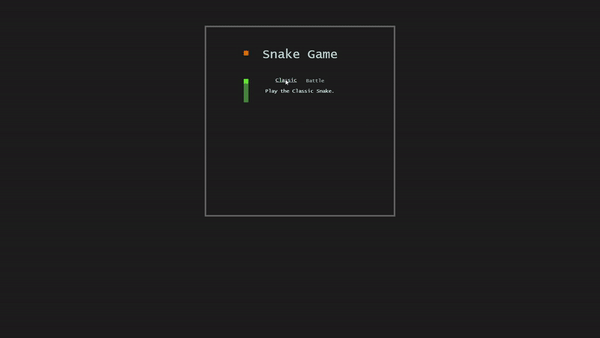
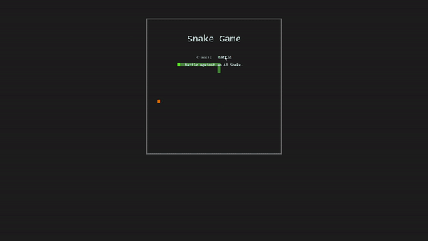

# Snake Game with AI Battle Mode


Snake Game with Classic and AI Battle Modes
---
Game is released here [Snake Game](https://doesdevstuff.github.io/SnakeGame-with-BattleMode/)


### Personal Objectives
- Create basic Game UI with HTML, JS and CSS
- Practice DOM manipulation from js and user input
- Replicate the snake mechanics in javascript

<br>

## The Classical Snake Game features:
- The player can move the snake with the help of the arrow keys
- The snake can “eat the objects” (i.e. object disappears)
- Snake increases in length for each object eaten
- Snake has a trail as it moves
- Snake dies on contact with walls or itself

## Battle Mode
The basic premise of these multiplayer snake games is that you can kill the enemy snake by causing them to collide with your snake body.

Features:
- Both player and AI Snake appears simultaneously on the board
- AI Snake moves randomly on the board and dies as per game rules
- Game mechanics remain the same for player snake with the addition that it dies upon contact with AI snake body

#### AI snake
- AI Snake is "fruit" seeking, making its movements more natural and less erratic
- Able to respawn after death with delay
- Grows with the same mechanics as player snake

## The DOM

### The Game Board
The game board consists of a 40 x 40 (configurable) grid of divs, each with a fixed size of 10 by 10 pixels. Each square on the board is represented in the code by a simple `{i, j}` coordinate system.

Background color of the divs are switched on/off to animate the game objects at 100ms intervals.

Bootstrap was used to organize and centralize the game board and additional CSS styles to fix default sizes and colours.

## Overall Game Flow 

### Classic Snake Mode


- "Animation" of snake kicks off based on default direction of snake
- At every refresh interval (set at 100ms), the game board clears and the snake gets "re-drawn" based on the direction of the snake 
- Snake direction is updated based on the arrow key press by the user
- Each refresh of the snake will check 3 things:

|Condition						|Yes				|No		|
|:-------------------------------|:-------------------|:-------|
|Is snake out of bounds?		| Dies. Game over.	| Continue movement|
|Did snake collide with itself?	| Dies. Game over.	| Continue movement|
|Did snake eat the fruit?		| Increment snake length by one segment, inserted at tail | Continue movement|


#### Game Objects - Coordinate, Snake, Fruit
Game components were implemented as Classes to allow multiple instances of each object. DOM manipulation functions were directly included into the class methods for convenience.

The `Coordinate` class represents the position of a fruit or a segment of snake. The `dir` property  is used to represent the direction of that particular snake segment (used for AI snake navigation).

```js
class Coordinate {
    constructor(i = 0, j = 0, dir = "e") {
        this.i = i;
        this.j = j;
        this.dir = dir;
    }
}
```

The `Fruit` class represents the fruit/target of the Snake. `position` takes on a coordinate object. 
```js
class Fruit {
    constructor() {
        this.position = getEmptyCoordinate();   //Initializes with a Coordinate object at random empty location
        this.color = fruitColor;
    }
    resetPosition() {}  //Looks for a random empty coordinate (no snakes) and updates the fruit position
    setDisplay() {} //Displays the fruit in the DOM
}
```

The basic `Snake` class represents the default player snake. 
```js
class Snake {
    constructor(i = start_i, j = start_j) {
        this.position = []; //array of Coordinates
        this.direction = "e";
        //...other snake properties
        //Initializes a baby snake on the grid
        for (let x = 0; x < startLength; x++) {
            this.position.push(new Coordinate(i, j))
            j--;
        };
    }
    move(){}    //Moves snake based on current direction
    pushSegment(coordinate){} //Adds a new segment at the tail based on coordinate
    setDisplay(){}  //Displays the snake in the DOM
    isInSnake(i,j,includeHead=false){}  //Checks if i,j is within the snake
    isAtApple(fruitObj){}   //Checks if the snakehead is in the fruitObj
    //...other snake methods
}
```

The constructor includes a for loop that creates a baby snake of `startLength`, located at `{start_i, start_j}` upon instantiation.

The `position` property stores an array of coordinate objects representing the coordinate and direction of each segment of the snake.  

```js
// a 4 unit snake with its head at position (24,5) on the grid, and all segments heading east.
position: [ {i:24, j:5, dir:"e"}, {i:24, j:4, dir:"e"}, {i:24, j:3, dir:"e"}, {i:24, j:2, dir:"e"} ] 
```

The `direction` property keeps track of the current bearing of the snake and takes the values `n`, `s`, `e`, or `w`. This can be dynamically changed by the event listener on the user's arrow keys.

After instantiation, the `move()` method in the snake is called at every 100ms interval to update the position of the snake based on its `position` and `direction` values. 

Every time `move()` is executed:
1. Starting from the tail, each segment's coordinate and direction is updated to the one ahead of it.
2. The head of the snake is incremented 1 unit in the direction of the `direction` value and updated with the new direction.

This ensures that the snake constantly follows through the trail of its head, whichever path it takes.

### Battle Snake Mode
 

- The player snake behaves the same way as in the Classic version
- An AI Snake (in green) is added as an obstacle/enemy for the player to avoid/kill
- The AI Snake generally minds its own business and blindly seeks for its fruit (in orange), it also grows, dies with the same rules as player snake
- The player snake can kill the AI Snake by causing the AI Snake to collide into the players body
- Upon death, the AI Snake regenerates after a 4 second delay
- Each refresh interval now has an additional check for collisions between snakes


The Snake game mechanics largely remain the same in this version. The only new addition was an AI Snake which gives the player a "live" and moving obstacle to avoid or destroy.

A large part of the effort went into developing an AI Snake navigation algorithm to enable it to move "naturally".

The `AISnake` class extends the original `Snake` with additional methods that help with navigation.
```js
class AISnake extends Snake {
    constructor(i = start_i - 5, j = start_j - 5) {
        super(i, j);
        //...other AISnake properties
    };
    isNewPosInSnake(dir){}  //Checks if the snake's next intended move will collide with itself
    autoMove(fruitObj){ //AI Snake navigation logic
        //Logic to determine the best "direction" goes here
        //...
        this.move();
    } 
}
```

By far the most challenging part of this project was to implement the `autoMove()` method, which determines the best `direction` to set for the AI snake given the current state of the board.

The original intent was to allow the AI snake to make random turns on the board, by updating the `direction` with a random (and valid) value for each refresh interval. 

However, upon further consideration, random turns could result in very erratic movements, which will need to be handled by "smoothing" the randomness of the suggested direction. <br>
Other edge cases will also need to be considered - e.g. How to get the snake out of the corner of the game board? How to avoid collision with itself?

In order to solve this, I had to consider the relative position of the fruit with respect to the snake head position (and direction) at every refresh interval, and decide if a change in direction is required, and if so, which direction to give. 

#### AI Snake with a length on 1 unit
With a simple "snake" of 1 unit in length, and the target fruit is N-E relative to the snake head, the psuedo code to determine the best direction would look like this:
```
//Psuedocode to handle first condition
At every refresh interval,
IF fruit is N-E with respect to snake
    IF snake is moving E
        IF snake is vertically aligned with fruit
            SET direction to N
        ELSE continue travelling E
    ELSEIF snake is travelling N
        IF snake is horizontally aligned with fruit
            SET direction to E
        ELSE continue travelling N
    ELSEIF snake is travelling S
        SET direction to E
    ELSEIF snake is travelling W
        SET direction to N
```
Given the basic 2-dimensional game board we will only need to replicate this logic symmetrically 4 ways - fruit relative positions at NE, NW, SE and SW. Code snippet [here]https://github.com/DoesDevStuff/SnakeGame/blob/208ca7661b1f02964fe678b7b070a2644cb57b88/script.js#L402-L474

#### AI Snake with more than 1 unit length
owever, as the AI snake grows in length, and given the randomness of fruit respawn, snake would inadvertently run into its own body. The suggested direction will then need to be modified when this happens, and this will be dependent on the direction of the snake segment it is about to collide into.

The following psuedo code handles this:
```
//Psuedocode to avoid self collision
IF the suggestedDirection will result with self collision
    IF snake is moving E
        IF segment of snake to be collided with has direction S
            SET direction N //to prevent death traps
        ELSE IF ... //vice versa
```
Again, this would be replicated symmetrically in 4 directions. Code snippet [here]https://github.com/DoesDevStuff/SnakeGame/blob/208ca7661b1f02964fe678b7b070a2644cb57b88/script.js#L477-L516

## UI / UX
- To give it a more arcade game feel, start screen display is absolutely positioned on the centre of the screen and hidden when game starts
- A demo AI Snake is also loaded on the start screen to give users an indication of how the game works
- Countdown timers with fade out animations were used to give players time to anticipate game starts/AI respawns
- Snake tail colors were given 50% opacity of their head colors to appear as though they are "trails" left by the snake head

## Challenges
- Spent quite a bit of time of figuring out the right CSS, HTML to get display right. Would need to figure out a more functional way of manipulating dom.
- Generating random location respawn for fruit was not trivial.
